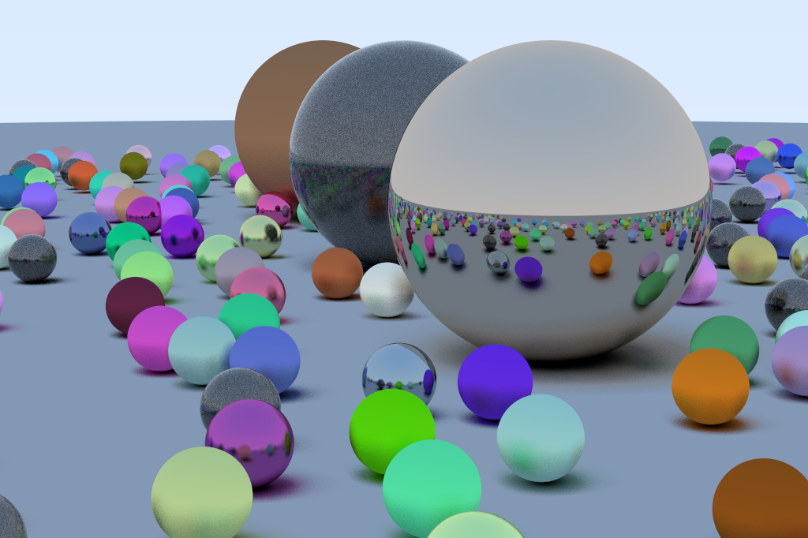

== ICL

== Raytracer

.running raytracer
[source,shell]
----
mkdir -p calc_target && \
mvn -q -e  javacc:javacc compile exec:java -Dexec.mainClass="App" -Dexec.args="compile raytracer.calc" && \
java -Xss16m -cp calc_target/ Main > img.ppm && \
convert img.ppm img.png
----

== Running

.Run interpreted
[source,shell]
----
mvn javacc:javacc compile exec:java -Dexec.mainClass="App" -Dexec.args="run <script name>"
----

.Run compiled
[source,shell]
----
mvn javacc:javacc compile exec:java -Dexec.mainClass="App" -Dexec.args="crun <script name>"
----

.Run interactive
[source,shell]
----
mvn javacc:javacc compile exec:java -Dexec.mainClass="App" -Dexec.args="interactive"
----

=== RESOURCES
JavaCC Documentation::
	https://javacc.github.io/javacc/documentation/

EBNF Wiki Page::
	https://en.wikipedia.org/wiki/Extended_Backus%E2%80%93Naur_form

Crafting Interpreters Book::
	https://craftinginterpreters.com

Java ASM Library::
	https://asm.ow2.io/
	https://asm.ow2.io/asm4-guide.pdf

Krakatau Java Assembler/Disassembler/Decompiler::
	https://github.com/Storyyeller/Krakatau
